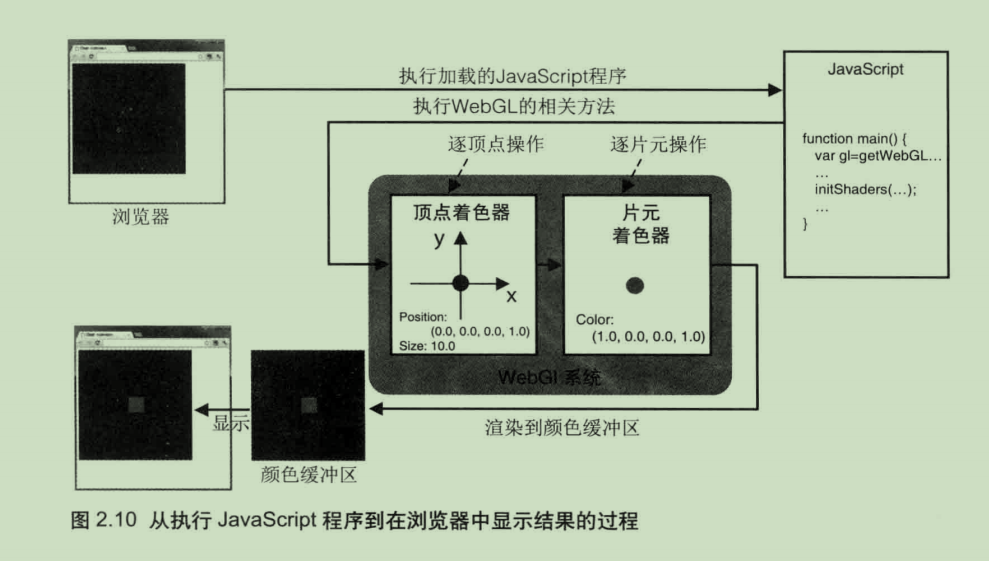
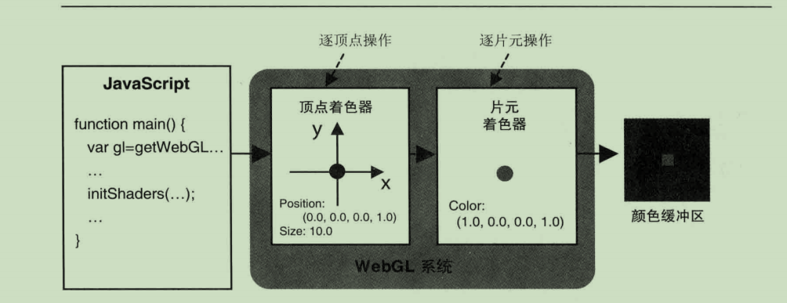
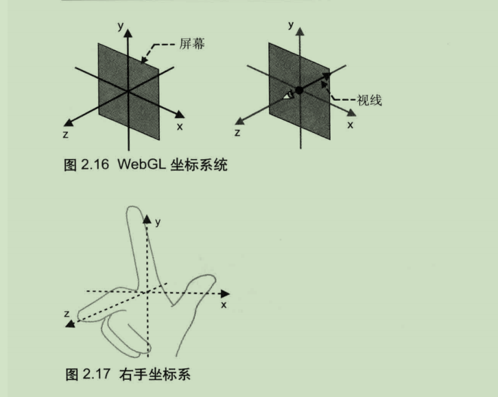
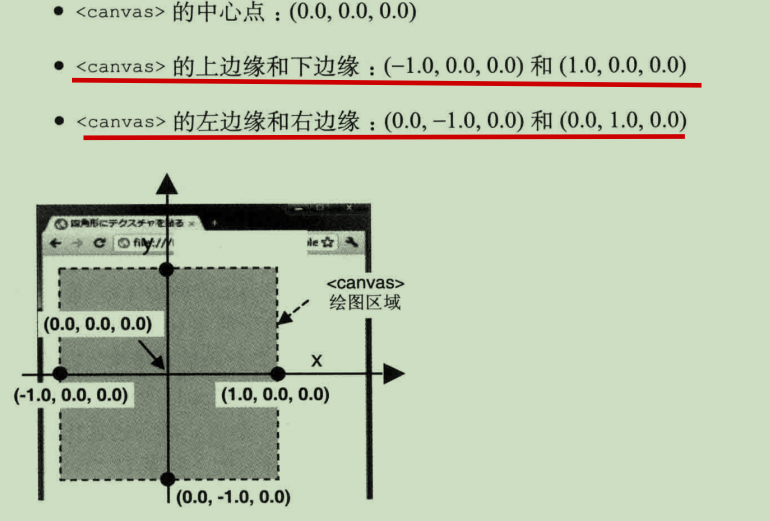

## 着色器
webGL 需要两种着色器
### 顶点着色器 Vertex Shader
顶点着色器用来描述顶点特性(位置,颜色等等)
顶点(vertex) 指二维或者三维空间的一个点, 比如二维和三维图形中端点和交点

### 片元着色器 Fragment shader 
进行逐片元处理过程 片元(fragment) 是一个webgl 术语, 你可以将其理解为像素, 图形的单元
顶点着色器控制点的位置和大小，片元着色器控制点的颜色。如前所述，片元就是显示在屏幕上的一个像素（严格意义上来说，片元包括这个像素的位置、颜色和其他信息)。

Javascript 处理的过程如下

## 齐次坐标
齐次坐标使用如下的符号描述:(X, y,z W)。齐次坐标(X, y,z,W)等价于三维坐标(x/w, ylw, zw).所以如果齐次坐标的第4个分量是1，你就可以将它当做三维坐标来使用。w的值必须是大于等于0的。如果w趋近于0，那么它所表示的点将趋近无穷远，所以在齐次坐标系中可以有无穷的概念。齐次坐标的存在，使得用矩阵乘法(下一章介绍）来描述顶点变换成为可能,三维图形系统在计算过程中,通常使用齐次坐标来表示顶点的三维坐标。
## 矢量(vector)也可译作向量
矢量(vector)也可译作向量，本书中除了在一些特殊的语境下(比如“法向量”)，统一称为“矢量”。—译者注

## 坐标系统
由于WebGL处理的是三维图形，所以它使用三维坐标系统（笛卡尔坐标系)，具有X轴、Y轴和Z轴。三维坐标系统很容易理解，因为我们的世界也是三维的:具有宽度、高度和长度。在任何坐标系统中，轴的方向都非常重要。通常，在 WebGL中，当你面向计算机屏幕时，X轴是水平的（正方向为右)，Y轴是垂直的（正方向为下)，而Z轴垂直于屏幕(正方向为外)，如图2.16左所示。观察者的眼睛位于原点(0.0,0.0,0.0)处，视线则是沿着Z轴的负方向，从你指向屏幕（图2.16右)。这套坐标系又被称为右手坐标系(right-handed coordinate system)，因为可以用右手来表示，如图2.17所示。默认情况下 WebGL 使用右手坐标系，右手坐标系也会贯穿本书始终。然而，事实远远比这复杂。实际上，WebGL本身既不是右手坐标系，又不是左手坐标系的。

## 缓冲区对象 buffer object 

WebGL提供了一种很方便的机制，即缓冲区对象(buffer object)，它可以一次性地向着色器传入多个顶点的数据。缓冲区对象是WebGL系统中的一块内存区域，我们可以一次性地向缓冲区对象中填充大量的顶点数据，然后将这些数据保存在其中，供顶点着色器使用。

## 变换 (transformations)
## 仿射变换 (affine transformations)

## 图元光栅化
发生在图元到片元的转化, 称为图元光栅化( rasterzation process)

几何图形在装配的过程被称为 图元装配过程 primitive assembly process 因为被装配出的基本图形 点,线,面 又被称为图元 primitives
