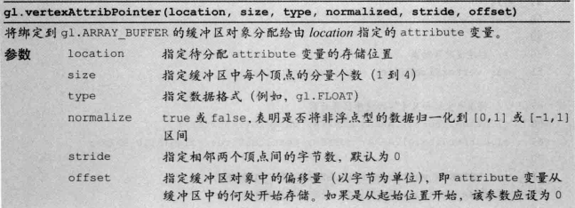
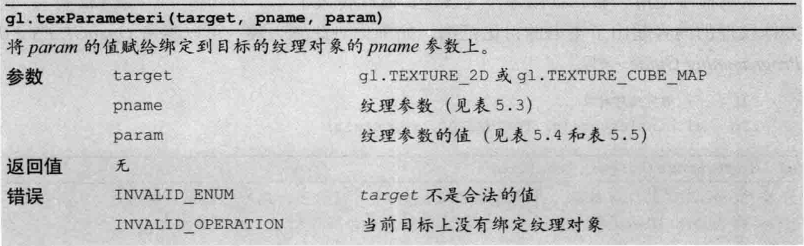

## gl.drawArrays(mode , first, count)

## gl.getAttribLocation(gl.program, 'funcName')

## gl.drawArrays()

## gl.vertexAttribPointer

## gl.createTexture() 创建纹理对象
## gl.deleteTexture(texture) 删除纹理对象

## gl.texParameteri()

pname: 默认值: param
放大: gl.TEXTURE_MAG_FILTER 默认值  gl.LINEAR
缩小: gl.TEXTURE_MIN_FILTER        gl.NEAREST_MIPMAP_LINEAR
水平填充: gl.TEXTURE_WRAP_S         gl.REPEAT
垂直填充: gl.TEXTURE_WRAP_T         gl.REPAET

可以赋值给gl.TEXTURE_MAG_FILTER 和 gl.TEXTURE_MIN_FILTER的非金字塔纹理类型常量
gl.NEAREST
使用原纹理上的距离映射后像素(新像素) 中心最近的那个像素的颜色值,作为新像素的值(使用曼哈顿距离)

gl.LINEAR 使用距离新像素中心最近的是个像素点的颜色值加权平均, 作为新像素的值(与gl.NEAPEST 相比,该方法图像效果更好, 但是会有较大的开销)

可以赋值给gl.TEXTURE_S 和 gl.TEXTURE_WARP_T 的常量
gl.REPEAT 平铺式的重复纹理
gl.MIRRORED_REPEAT 镜像对称式的重复纹理
gl.CLAMP_TO_EDGE 使用纹理图像边缘值

纹素数据的格式
gl.RGB 红绿蓝
gl.RGBA 红绿蓝透明度
gl.ALPHA (0.0,0.0,0.0, 透明度)
gl.LUMINANCE L,L,L,1L: 流明
gl.LUMINANCE_ALPHA L,L,L, 透明度
这里的流明(luminance) 表示我们感知到的物体表面的亮度, 通常使用物体的表面的红绿蓝颜色的分量值的加权平均来计算流明

## gl.getShaderPrecisionFormat() 检测支持的精度

## Matrix4.setLoookAt(eyex, eyey, eyez, atx, aty, atz, upx, upy, upz )
视点, 观察点, 上方向    
