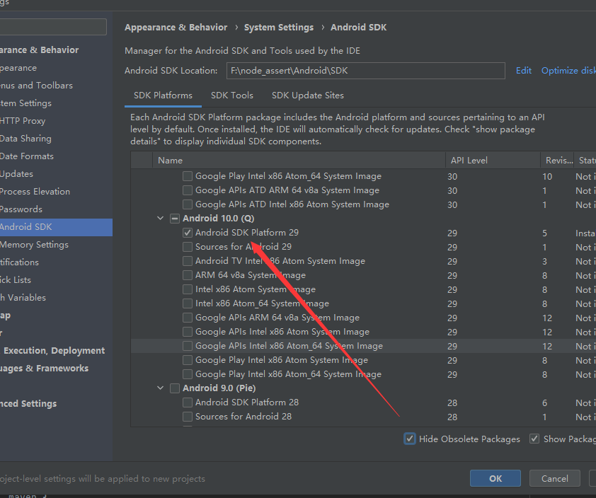
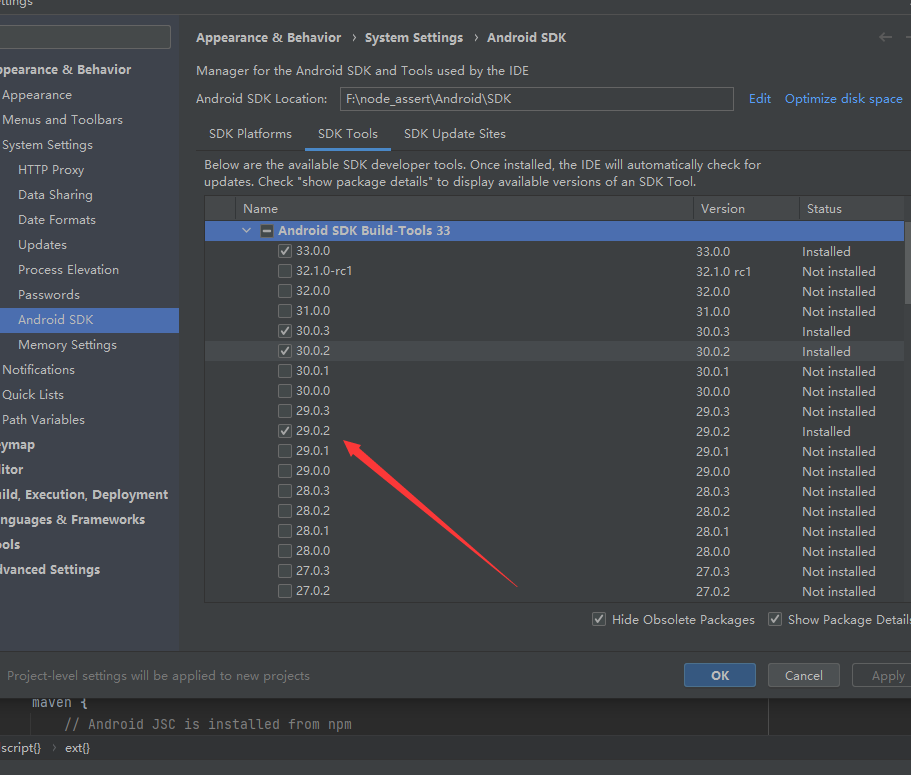
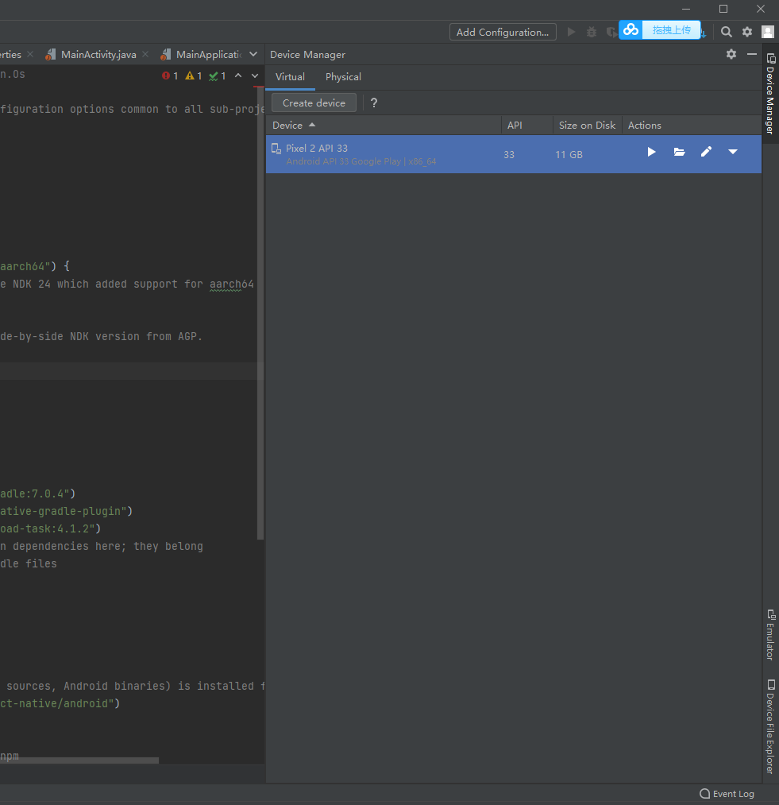
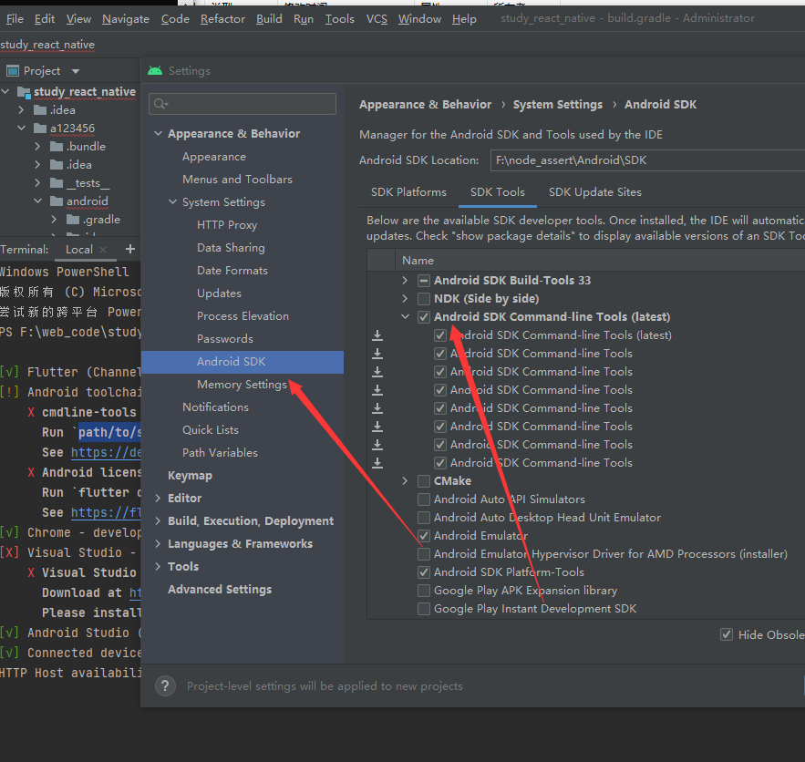

## 官网
[click me](https://flutter.dev/)
安装包链接  
https://flutter.dev/docs/get-started/install  
[中文官网](https://flutter.cn/)

需要 git 
android studio

安装安装10 并且安装模拟器
然后下载 flutter 的安装包 

设置代理环境变量

export PUB_HOSTED_URL=https://pub.flutter-io.cn
export FLUTTER_STORAGE_BASE_URL=https://storage.flutter-io.cn

解压之后添加到环境变量 path 
F:\flutter\flutter_windows_3.0.2-stable\flutter\bin

# 输入命令检查是否安装成功
flutter doctor  
如果出现授权问题 输入  
flutter doctor --android-licenses  
全部输入 Y   

## 查看已安装的模拟器 
flutter emulators

## 启动模拟器

flutter emulators --lanuch 设备名

## 初始化项目 
flutter create my001
cd my001 
flutter run 
